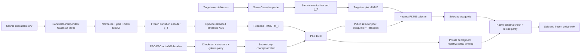

# Policy Learnware v0 / v0.1 / v0.2 / v0.3 / v0.31

## v0.31：Raw-RKME 方法角色修订

v0.31 不另开分支，也不重写算法或冻结产物。根据 v0.3 development 结果，论文主算子改为
**Raw-RKME Learnware**：canonical raw transitions 经 source-only normalization、跨任务
padding/mask canonicalization 后，构建 source Reduced RKME 与 query Empirical KME，并以
Gaussian MMD 最近邻完成复用。原 `B3b` 仅作为冻结 artifact ID 保留。

| 冻结 artifact ID | v0.31 论文角色 | 展示名 |
|---|---|---|
| `B3b` | 主方法 | Raw-RKME Learnware |
| `A-Env` | 表示学习比较变种 | Learned EnvironmentSpec, distance-only |
| `M02/B5` | competence 融合比较变种 | Learned EnvironmentSpec + global competence fusion |

`competence_i` 不再进入主检索公式，只保留为 source-side 质量信息或诊断量。历史 JSON/CSV、
method ID、RKME/MMD 公式和 selector 数值逻辑均不改名、不重算。完整的结果、证据边界与后续
最小实验计划统一记录在
[Policy_Learnware_v0.31_Plan_and_Report.md](docs/Policy_Learnware_v0.31_Plan_and_Report.md)。
当前证据仍是 `formal=false` 的 development 结果，不能表述为 confirmatory 结论。

## v0.3：最小可复现实验闭环

2026-08-27 起，v0.3 采用硬性 Occam 边界：仓库只维护
`加载 policy/encoder 资产 → 构建 RKME → query/source 匹配 → 真实策略复用 → 记录必要 metrics`
这一条可执行链。只有缺失/不可反序列化资产、tensor ABI 或 shape 不兼容、NaN/Inf、
真实 rollout 失败、RKME 表征协议/latent dimension/kernel bandwidth 不兼容，以及全池没有
ABI-compatible 候选会阻断运行。golden/compiled parity 的有限漂移、历史 norm 或重构误差、
provenance/digest 漂移、competence floor 和低回报只写入 metric/warning，不再作为事前门禁。
单个坏候选被隔离；只有某个 anchor 的全部候选都无法真实运行时，该 anchor 才失败。

v0.3 保留 13 个 transition views + 1 个历史 random-tanh control、39 个逻辑 cells、37 个
数值 cells、45 个 R5/R5L fits，以及基础 baseline。Encoder-family 复现、LOTO 和大型
ablation 全部属于 v0.4，v0.3 不读取也不要求这些 checkpoint。source market 使用一次真实
selection rollout 后直接按 anchor 选优；不再重复 30 次 admission-only attestation。

最小 CLI 与服务器入口：

```bash
# 数值闭环与 14-control 计划（不启动大实验）
PYTHONPATH=src python -m policy_learnware_v0.v03 accept-numeric
PYTHONPATH=src python -m policy_learnware_v0.v03 signal-plan

# 从现有 v0.2 pool 建立最小运行绑定
PYTHONPATH=/absolute/vendor:src:. python -B \
  -m server.repro_fpo_ppo_v03.asset_binding \
  --intake-record /absolute/v02_pool_intake/intake_record.json \
  --server-plan /absolute/server_training_plan.json \
  --fpo-root /absolute/fpo_checkout \
  --vendor-dir /absolute/vendor \
  --output-dir /absolute/new_binding

# 单通道真实 source-market；nonce 参数可省略
PYTHONPATH=/absolute/vendor:src:. python -B \
  -m server.repro_fpo_ppo_v03.source_market_runner \
  --binding-dir /absolute/new_binding \
  --output-dir /absolute/v03_run/source_market \
  --fpo-root /absolute/fpo_checkout \
  --vendor-dir /absolute/vendor \
  --resume
```

`tests/v03` 只保留数值核心、signal plan 和 CLI 三组短测试；不再用数万行测试复制 schema、
receipt 或 authority 状态机。运行产物继续原子写入且默认不覆盖，但这属于结果保护，不是
科学 admission。下面折叠内容是 Occam 修订前的设计记录，仅供理解历史，不是当前接口、
命令或 completion 合同。

<details>
<summary>历史 v0.3 设计记录（已废止）</summary>

### 旧版：RL MDP 规约信号图谱与基础策略复用比较

v0.3 位于独立 `v03` 分支。它从冻结的 v0/v0.1/v0.2 资产出发，回答一个比
“哪个 Encoder 更强”更基础的问题：在 candidate-independent 公共 probe 下，识别
RL 任务、goal 与同任务 dynamics context 并选择冻结策略，究竟依赖 transition 中的
哪些信号？本版以受控 view、表示读出阶梯、KME、匿名策略市场和策略选择结果组成一条
可复算的证据链。

v0.3 不修改 v0/v0.1/v0.2 的历史协议或 artifacts。v0.2 交付的 exact-90 policy-pool
handoff 是本版的只读资产输入；v0.3 负责复核它、产生 evaluator-owned source receipts、
冻结每个 anchor 的 champion，并发布 30-entry anonymous market。Faithful CORRO、CaDM、
DORA、MCAT、Proposed Encoder、六折 Encoder LOTO、family bake-off 和大型 Encoder
ablation 已迁入 v0.4，不是 v0.3 的 completion 依赖。

### v0.3 的 13+1 control 与表示矩阵

“14-control”在本仓库中的准确含义是 **13 个输入/扰动 views + 1 个历史随机表示
control**，不是 14 个可按单一分数排序的同类输入：

| 类别 | ID | 作用 |
|---|---|---|
| 完整参照 | `V_FULL_LEGACY` | 历史 packed transition 参照 |
| schema/ABI | `V_MASK_ONLY`、`V_DIMS_ONLY` | 测试 mask 或 native width shortcut |
| 单通道/占据 | `V_REWARD_ONLY`、`V_STATE_ONLY`、`V_ACTION_ONLY`、`V_STATE_ACTION` | 测试 reward、state/action marginal 与 occupancy 的充分性 |
| dynamics | `V_DELTA_ONLY`、`V_REWARD_FREE_TRANSITION` | 测试 reward-free transition signal |
| 删除/破坏 | `V_NO_MASK`、`V_SHUFFLED_NEXT`、`V_SHUFFLED_REWARD`、`V_TEMPORAL_SHUFFLE` | 删除显式 mask 或破坏 pairing/order |
| 历史表示 control | `V_RANDOM_ENCODER = R_HIST_RANDOM_TANH` | 固定为单层 random affine + tanh；不得与 matched 两层 `R3` 合并 |

正式 dynamics contrast 使用
`C_RF_SHUFFLED_NEXT=(o,a,perm(o'))`：它和 `V_REWARD_FREE_TRANSITION` 保持完全相同
的 channels 与 marginals，禁止 reward/mask，只破坏 next-state pairing。历史 full-base
`V_SHUFFLED_NEXT` 仅作 legacy control。`C_SCHEMA_COLLISION` 与 `C_EXACT_REPEAT` 是带
digest 的 pair/bank-level controls，不增加 view 数量。

Signal Atlas 不是 `13 views × all representations` 的无差别全排列，而是：

| Block | 条件 | 逻辑 cells |
|---|---|---:|
| Core paired atlas | 13 views × `{R0 Raw, R5 trained CORRO-style MLP}` | 26 |
| Historical control | `R_HIST_RANDOM_TANH` | 1 |
| Mechanism staircase | `{FULL, REWARD_FREE_TRANSITION, C_RF_SHUFFLED_NEXT}` × `{R1 random linear, R2 PCA/whitening, R3 matched random MLP, R5L supervised linear}` | 12 |

总计 39 个逻辑 cells。其中 one-step Raw/基础 MLP 不读取顺序，
`V_TEMPORAL_SHUFFLE × R0/R5` 是两项结构性 `N/A`，不训练、不以零值填充，也不进入
metric 分母，因此共有 37 个数值 cells 和 79 个可恢复 seed-level 工作项。只有 R5 与
R5L 需要优化：最多 36 个 R5 fits + 9 个 R5L fits，共 45 个小模型训练；其余表示为
确定性变换或冻结 replay。

### 基础 baseline 与 RKME 协议

v0.3 固定比较 9 个 required methods：

| ID | 方法 |
|---|---|
| `B0` | random anonymous market |
| `B1` | source/global champion |
| `B2` | v0 TaskSpec-NN → nominal champion |
| `B3a` | raw transition moments nearest |
| `B3b` | raw packed-event KME nearest（历史 ID；v0.31 论文主方法） |
| `B4a` | development-label kNN ranker |
| `B4b` | development-label linear ranker |
| `A-Env` | frozen CORRO EnvironmentSpec nearest |
| `M02/B5` | L-min + frozen CORRO-style（历史 ID；v0.31 competence 融合比较变种） |

`B4c` 和 `B6` 默认关闭，private best-in-pool oracle 只用于发布 public rankings 后的
skyline/regret 评估，不属于可部署方法。所有方法都必须对匿名 30-entry full pool 排序，
不得按 task、axis、algorithm 或 runtime 预筛。

主 RKME 合同为非对称的 **source-reduced / query-empirical**：source anchor 在离线阶段
构建 reduced RKME；target query 保持 empirical KME，并计算 empirical-to-reduced MMD。
这样避免为每个 query 重复执行 support reduction。它是 v0.3 formal 的唯一模式；如果
development 证据显示 query-empirical 有显著性能损失，query-reduced 只能使用新的
protocol ID 和新的 freeze 另行运行，不能在同一个 formal run 中自动回退。

### CLI：先验收，再由外部 freeze 启动正式链路

仓库无需预装 console script。服务器上的轻量工程验收可直接运行：

```bash
cd /share/songyf/RL_Learnware/policy_learnware_v0

V03_PY=/home/songyf/miniforge3/envs/GoRL/bin/python
v03() {
  PYTHONPATH=src "$V03_PY" -m policy_learnware_v0.v03.cli "$@"
}

v03 validate-config configs/v03_foundation_development.yaml
v03 accept-numeric
v03 accept-prelarge
v03 fit-representation-controls --dry-run
v03 build-signal-atlas --dry-run
v03 fit-baselines --dry-run
```

后三条 dry-run 只冻结/展示 45-fit plan、39/37 matrix 与 9-method registry；输出必须保持
`large_experiment_executed=false`，不会训练、读取 confirmatory oracle 或生成 formal
科学结论。

### 服务器最小实验入口

开源复现只需把现有资产路径传给三个薄 runner，无需重建 11-stage
manifest 树。三个入口都支持不可覆写的原子产物和 `--resume`：

```bash
PYTHONPATH=src:. python -B -m server.repro_fpo_ppo_v03.signal_fit_runner \
  --legacy-v0-root /absolute/frozen_v0_artifacts \
  --output-dir /absolute/new_v03_run/signal_fits \
  --shard-index 0 --shard-count 1 --train-steps 20000

PYTHONPATH=/absolute/vendor:src:. python -B \
  -m server.repro_fpo_ppo_v03.source_market_runner \
  --binding-dir /absolute/production_asset_bindings \
  --output-dir /absolute/new_v03_run/source_market \
  --fpo-root /absolute/frozen_fpo_checkout \
  --vendor-dir /absolute/vendor \
  --market-alias-private-nonce-file /absolute/private/alias.nonce \
  --tie-break-private-nonce-file /absolute/private/tie.nonce

PYTHONPATH=src:. python -B -m server.repro_fpo_ppo_v03.baseline_runner \
  --legacy-v0-root /absolute/frozen_v0_artifacts \
  --output-dir /absolute/new_v03_run/legacy_baseline
```

`signal_fit_runner` 执行 36 个 R5 + 9 个 R5L 真实 fits；
`source_market_runner` 执行 90 selection + 30 attestation 并发布 30-entry market。
默认 baseline 入口是可立即复算的历史六任务 M02/B5 development replay；这是兼容性入口，
不是 v0.31 的论文主方法。v0.31 主方法是 Raw-RKME Learnware（冻结 ID `B3b`）。
不冒充 P6 formal exact-nine；真实 30-market/24-context prepared inputs 到位后，
用 `--prepared-input-factory module:callable` 在同一入口运行现有 exact-nine 科学实现。
`--max-jobs 1 --train-steps 2`、`--max-selection 1` 和 `--max-queries 1`
仅用于隔离的资产对接 smoke，不得写入正式产物根。

v0.2 exact-90 handoff 使用只读 production intake；路径必须指向已冻结且受信的服务器
资产，不能用 synthetic fixture 代替：

```bash
v03 intake-v02-policy-pool \
  --handoff-dir /absolute/frozen_v02_handoff \
  --trusted-experiment-root /absolute/frozen_v02_experiment_root \
  --artifacts-root /absolute/v03_artifacts \
  --development-id v03-pool-intake-20260827-r0
```

成功状态 `POOL_READY` 只代表 exact-90 intake 通过；30 个 source champions、source
receipts 与 anonymous market 仍由后续 P5M stages 生成。

服务器侧随后执行一次 **validate-only** 资产绑定。该工具会重新校验 intake/plan 的
canonical bytes、显式 SHA-256 与 semantic digest，经冻结 FPO/JAX driver 对 90 个
candidate 逐一执行 `validate_candidate`，并盘点历史 v0 encoder、normalizer、kernel 与
dataset manifests；它不会 rollout、训练或生成 source return：

```bash
PYTHONDONTWRITEBYTECODE=1 \
PYTHONPATH=/absolute/vendor:/absolute/policy_learnware_v0/src:/absolute/policy_learnware_v0 \
python -B -m server.repro_fpo_ppo_v03.asset_binding \
  --intake-record /absolute/v02_pool_intake/intake_record.json \
  --intake-record-sha256 <reviewed-sha256> \
  --trusted-experiment-root /absolute/frozen_v02_experiment_root \
  --server-plan /absolute/frozen_v02_experiment_root/training_private/plans/server_training_plan.json \
  --server-plan-sha256 <reviewed-sha256> \
  --selection-ledger /absolute/policy_learnware_v0/configs/v02_selection_ledger.json \
  --fpo-root /absolute/frozen_fpo_checkout \
  --vendor-dir /absolute/attested_vendor \
  --legacy-v0-root /absolute/frozen_v0_artifacts \
  --output-dir /absolute/new_immutable_binding_root \
  --market-alias-private-nonce-file /absolute/private/alias.nonce \
  --tie-break-private-nonce-file /absolute/private/tie.nonce
```

生产协议不接受 episode 数或统计阈值的 CLI 覆盖：v0.2 已审核
selection ledger 固定 `25/50` episodes、`OBSERVE`、`0.5/0.01/1.645` 与
1000-step return contract；当前 v0.3 binding proposal 另固定 selection seeds
`100000..100024` 和 attestation seeds `200000..200049`。后两个具体 seed tuple
必须随后续整份 formal freeze 进入外部 review authority，不会因为资产绑定
通过而自动升级为已审核科学协议。ledger 的 file/semantic/config/experiment
digests 均是代码内受信常量，调用者不能通过自报 digest 更换它。

两个 nonce 文件必须不同、非 symlink、权限精确为 `0600`，各含一个不同的 64 位小写
hex 值；原值与路径都不会进入公开产物。成功状态为 `ASSET_BINDINGS_READY`，固定
`formal_run_authorized=false`：它只发布 `SourceEvaluationProtocol`、90 个 selection work
units、90-cell `FormalMarketPlan`、legacy inventory 与总 binding receipt，不能替代 P5M
真实 90+30 receipts、championization 或 30-entry market。

正式运行采用以下 11-stage 线性、digest-bound 链路：

```text
collect-source-receipts
-> build-market
-> build-canonical-banks
-> build-transition-views
-> replay-legacy-attribution
-> fit-representation-controls
-> build-signal-atlas
-> build-source-specs
-> build-query-specs
-> fit-baselines
-> run-public-rankings
```

每一 stage 都要求外部审核后的 freeze、该 stage 的 typed manifest、显式 server adapter
和不可覆写 artifact root，例如：

```bash
v03 build-signal-atlas \
  --stage-manifest /absolute/manifests/build-signal-atlas.json \
  --freeze-manifest /absolute/reviewed/formal_freeze.json \
  --artifacts-root /absolute/v03_formal_artifacts \
  --adapter-entrypoint reviewed_server_adapter:create_adapter \
  --resume
```

在启动任何 stage 前，可对 authorized freeze及其外部receipt文件、11份stage launch
manifests/request templates、adapter identity/contract、adapter module root下由
`module:attribute`入口唯一映射的leaf module `.py` bytes、固定
前序拓扑和全部预存static input bytes做严格只读验收：

```bash
v03 preflight-formal \
  --manifest /absolute/reviewed/formal_pipeline_launch.json \
  --freeze-manifest /absolute/reviewed/formal_freeze.json
```

通过时返回 `FORMAL_STATIC_BINDINGS_READY`，并固定
`adapter_executed=false`、`artifacts_written=false`。该命令不导入或调用stage adapter，
不写artifact，也不能签发review authority。它只证明已审核的静态文件、入口声明和digest
当前一致，不能证明adapter能够成功训练或生成科学产物；实际启动时传给driver的
`--adapter-entrypoint`仍必须与该静态声明一致并通过runtime admission。未来的前序receipt、
运行时manifest和输出bytes仍在每个stage实际执行前由正式driver逐文件复核。authorized freeze及外部
receipt的真实性仍由项目的外部review/signature信任边界负责；本命令只复核其已声明的
canonical receipt bytes与semantic digest，不能把调用者自写的receipt升级成authority。这里的
外部 authority receipt 会同时反向绑定整份 freeze authorization surface
（config、implementation、gates、query/statistics/cost 与全部规约 digests）和 launch
surface（11个stage、entrypoint、leaf source SHA、templates、static inputs与module
root），因此替换任一科学规约或源码并重算manifest自身digest仍会失败。
源码绑定不覆盖package `__init__.py`、传递依赖或动态加载代码，也不保证Python运行时从同一
module root导入；当前generic stage driver尚未实现把这份静态报告作为强制runtime admission并
写入receipt，故该缺口闭合前不得启动formal stage。

`--resume` 只复核并复用 byte-identical work units，不允许覆盖或静默换输入。CLI 可以发布
未授权的 engineering freeze，但不能自行铸造 review authority；正式 manifest 必须由外部
review handoff 提供，并同时满足 `review_authority_verified=true` 与
`formal_run_authorized=true`。public rankings 与预先冻结的 pre-oracle signal manifest
落盘后，`unlock-oracle` 也只生成 handoff；confirmatory oracle 的解封权仍属于
`policy-learnware-paper1` 联合 orchestrator。

### v0.4 extension gate

v0.3 formal 固定：

```yaml
encoder_extension_gate:
  enabled: false
```

关闭时不得要求 CaDM/DORA/MCAT/Proposed checkpoints、family IDs、LOTO manifests、
额外 GPU dependencies 或额外 market representation indices。formal freeze 若把它设为
`true` 必须 fail closed。显式开启只允许隔离的 v0.4 development interface smoke，且固定
`completion_eligible=false`、`confirmatory_artifact_access=false`、
`formal_authority=false`；其产物不得写入 v0.3 formal/confirmatory root。

### 测试与正式启动条件

本地或服务器的 v0.3 专属回归：

```bash
PYTHONPATH=src:. "$V03_PY" -m pytest -q tests/v03
PYTHONPATH=src:. "$V03_PY" -m compileall -q \
  src/policy_learnware_v0/v03 server/repro_fpo_ppo_v03
```

2026-08-27 的 clean `v03` 服务器验收为 `340 passed, 1 skipped`；GoRL 环境使用
JAX 0.7.2，GPU 可见，真实 R5/R5L backend 的最小初始化/fit smoke 已通过。这个结果只说明
代码、合同和最小训练路径可执行，不表示 79 项 Signal Atlas、45 个 fits 或 baseline
真实矩阵已经运行。

同日的 production asset binding 已在服务器对 exact-90 进行 90/90
`validate_candidate` 并通过，发布状态为 `ASSET_BINDINGS_READY`。binding receipt
digest 为 `161667e7432b507382c9cb1cc08cbab7287ecc01f7bf18d075ccd35700b0dad4`，
file SHA-256 为 `1b3f8e4baae5a29553d2c8f62375b38fdeaa017faf203dbaa9ef0906ce9f56f9`。
该步骤明确记录 `rollout_executed=false`、`training_executed=false`、
`private_nonces_persisted=false` 和 `formal_run_authorized=false`。

把 `formal_run_authorized` 置为 `true` 前，外部审核必须逐项绑定并复核：

- P5R 已验证的 v0.2 exact-90 intake record、source-pool/cell digests 与受信 handoff root；
- `SourceEvaluationProtocol`：evaluator/return contract、selection 与 attestation 的隔离 seed blocks、每类 episode 数、30 个 source environment bindings、`OBSERVE` competence literals；
- `FormalMarketPlan`：90 个 candidate→intake cell/source anchor/deployment ABI 的逐项绑定、30 anchors × 3 candidates、预期 30-entry market，以及彼此独立的 market-alias/tie-break commitments；
- `G03-Attribution`、`G03-Probe`、`G03-Market` 三个 formal gate plans，而不是运行后才产生的 admissions；
- 11 个 production stages 的 request templates、线性依赖、静态 input bytes 与逐 stage server-adapter binding digests；
- `PublicQueryPlan` 的 66-query 计划（30 exact、24 interpolation、12 extrapolation）、9-method/24-development-context baseline input plan、pre-oracle signal outcome plan，以及 oracle owner、零预读、ranking-before-unlock 的 isolation/handoff 计划；
- source-fitted global canonicalizer、真实 CP0/CP2 与 source train/validation/reference/query bank bindings，historical normalizer/checkpoint、13+1 registry、pair controls、applicability ledger、source-reduced/query-empirical kernel/reducer 设置及最大 prefix memory/kernel smoke；
- clean commit、external review authority、独立 formal artifact root、immutable resume、statistics/cost/recompute plans；
- `encoder_extension_gate.enabled=false`，且不存在任何 v0.4 completion dependency。

只有这些输入和权限进入同一份审核后的 freeze，才可以启动大规模 14-control 信号实验
（含 45 个正式 fits）与基础 baseline 比较。90 份 source-selection receipts、30 份 champion
attestation receipts、championization/30-entry market、三项 formal admissions、pre-oracle
signal manifest、594 条 public rankings 与实际 `PublicRankingBarrier` 都是授权后的 formal
run 或 completion 阶段产物，不是授予 authority 的前置产物，也不得提前伪造。最终
completion 仍要求这些产物、全部 stage receipts、oracle handoff、统计、独立复算和 claim
audit 同时通过；服务器 smoke、dry-run 或部分 cell 成功均不能单独替代 completion。

</details>

## v0.2：source-anchor frozen market 与 L-min sidecar

v0.2 在独立 `v02` 分支上实现 dynamics-axis/anchor 环境、source-specialist
训练 provenance、匿名全市场、replaceable `EnvironmentSpec` 表征、L-min、B0–B5
baselines、development P/private O/reference E tables、return/regret/ranking metrics、
hierarchical bootstrap、max-T/Holm/non-inferiority、cold/warm cost、information isolation、
independent recompute 与不可覆写 completion。v0.2 冻结 handoff milestone 记为
`READY_FOR_V03_MARKET_INTAKE`：它交付 exact-90 source candidate-pool handoff，
不是 30-entry champion market，也不是 Paper-I held-out 实证结论。真实 source
receipts、championization、market intake 与后续 benchmark 全部由 `v03` 分支执行。

关键边界：

- public market 只有 opaque learnware ID、source competence 与独立
  `tie_break_token`；task/reward/axis/factor/seed/bundle/runtime/ABI 均不可见；
- 所有 selector 排完整匿名池，不按 source task 或 runtime 预筛；选择发布后，私有部署
  才用 task-anonymous minimum `ExecutionABIRecord` 判断是否可执行；
- source/development probe 可用于冻结 scorer 与 conventional incumbent；v0.2 CLI
  不能实例化或读取 Paper-I sealed target、ranking 或 confirmatory oracle；
- dynamics operator 只接受 reviewed registry 的 `axis_id + factor_id`，在 fresh native
  environment 上做 allowlisted model mutation，并验证 identity、isolation、finite/JIT 和
  mass–inertia coupling；
- 服务器训练由 `server/repro_fpo_ppo_v02/` 的 digest-bound queue 执行。它没有任何
  task/axis/factor/algorithm/seed/budget 默认值；只有 reviewed anchor manifests、training
  protocol 与 seeds 均冻结后才会生成或启动真实 jobs。`config_digest` 与
  `execution_purpose` 贯穿 job、attempt、checkpoint、bundle、record 与 queue result；只有
  `v02_freeze_ready + GPU` 可以进入 formal admission，development GPU 和 CPU/debug smoke
  均不能升级。
- exact-90 handoff 对 `30 anchors × seeds 0/1/2` 做逐字节复核。正常终态直接接纳；
  仅因 reload compiled-policy parity 失败的六个终态由 append-only promotion record
  指向同一 attempt 中最后一个已经通过 finite、golden parity 与 compiled parity 的
  canonical checkpoint。它不放宽 tolerance，也不接纳失败的新 checkpoint。
- 该 handoff acceptance 是 v0.3 的只读资产输入，不冒充既有
  `TrainingRunRecord` admission、真实 championization 或 30-entry market。v0.3 必须先
  fail-closed intake，再用 evaluator-owned source receipts 完成 champion/market。
- 正式 protocol freeze 同时绑定 config 原始 bytes、四类 config projection、Git clean
  commit 和 v0.2 package/server implementation tree；所有后续正式命令都会重验该 freeze。
- 正式 gate/recompute 使用不可序列化的进程内 authority；裸 `true` JSON、手写 digest 或
  重新加载的归档 report 都不能生成正式 completion。当前 formal gate evaluator registry
  为 `0/35`、formal recompute authority loader 为 `0/8`；其中 5 个纯数据 section 已有严格
  structural inverse，但在科学协议与 frozen runtime registry 接通前不授予 authority。因此
  formal `READY` **明确 fail closed、不可达**，不能用 checksum-only CLI 或 development
  adapter 冒充完成。
- `evaluate-source-competence` 的 JSON 数值行、预计算 `EnvironmentSpec`、直接 selector
  index/query、上传 value map 和上传 information audit 均只允许 development/audit；正式
  路径必须等待 evaluator-owned raw episode/probe receipts 与已评审统计 literals。

依赖较轻的代码验收：

```bash
PYTHONPATH=src:. pytest tests/v02 -q
PYTHONPATH=src:. pytest server/repro_fpo_ppo_v02/tests tests/v02/test_server_training_bridge.py -q
PYTHONPATH=src:. python scripts/run_v02_cpu_acceptance.py
```

冻结的服务器训练树可用 append-only CLI 生成 promotion manifest 并复核 exact-90
handoff；两个输出路径必须尚不存在：

```bash
PYTHONPATH=src:. python scripts/accept_v02_policy_pool.py prepare-promotions \
  --server-plan /absolute/server_training_plan.json \
  --runs-root /absolute/server_runs \
  --output /new/private_validation/compiled_parity_promotions.json
PYTHONPATH=src:. python scripts/accept_v02_policy_pool.py accept \
  --server-plan /absolute/server_training_plan.json \
  --runs-root /absolute/server_runs \
  --promotions /new/private_validation/compiled_parity_promotions.json \
  --output /new/private_validation/policy_pool_acceptance.json
```

CPU acceptance 会真实跑通 2 tasks × 5 shared-nominal anchors × 2 seeds、9 methods、
full-pool private development oracle、metrics/cost/report，并覆盖 scientific-pass、market
No-Go、CORRO No-Go 与 engineering-blocked 四种终态；它始终带
`formal_completion_claimed=false`，只验代码链路，不替代六任务正式实验。

`configs/v02_discovery.yaml` 与 `configs/v02_freeze_ready.yaml` 是 fail-closed RFC
模板；其中 `REVIEW_REQUIRED/null` 字段未经过研究者冻结时，`validate-config`、
`freeze-run` 和 `plan-training` 必须拒绝执行。`configs/paper1_joint_confirmatory.yaml`
属于后续唯一 joint orchestrator 的 schema 草案，不由 v0.2 CLI 执行。

## v0.1：dynamics-shift diagnostic

v0.1 是一个独立的诊断实验，不是新的 selector。它保持 v0 的 frozen
TaskSpec 表征和 `outer006` policy pool 不变，回答两个先于 TransferSpec 的问题：

1. 同一任务内的受控 dynamics shift 是否会让冻结 policies 产生候选相关的迁移差异；
2. 当前 candidate-independent TaskSpec 是否能稳定感知这种 shift。

对任务 $q$，实验族固定为

$$
\mathcal M_{q,\lambda}
=(\mathcal S_q,\mathcal A_q,P_{q,\lambda},r_q,\rho_{0,q},H),
\qquad
\lambda\in\{0.5,0.75,1.0,1.5,2.0\},\quad H=1000.
$$

注册算子 `global_nonzero_dof_damping_scale` 只把 MuJoCo model 中原本非零的
DoF damping entries 同时乘以 $\lambda$；$\lambda=1$ 是 nominal instance，且
$\lambda$ 在一个 episode 内保持不变。它应被理解为
*one-dimensional contextual intervention inducing a correlated damping
perturbation*，而不是单关节参数变化。

### 冻结边界

- `WalkerWalk` 是 infrastructure task，`FingerTurnEasy` 是 confirmatory replicate；
- observation/action 的维数、slot 语义、单位和 bounds 不变；reward、reset、
  termination、horizon、action repeat、task goal 与 morphology 不变；
- 每个任务固定使用 10 个 `outer006` policies，即 PPO/FPO 各 5 个 seeds，训练预算为
  5,898,240 environment steps；policy 不微调、不续训、不换 checkpoint；
- random probe 可以在 shifted pseudo-real 环境运行，但保持 candidate-independent；
  候选 rollout 只构成 private oracle，不能进入 TaskSpec 或 selector 输入；
- 复用 v0 冻结的 109D padding+mask、32D transition encoder、Gaussian kernel、
  normalizer 与六个 source RKMEs，不用 shifted data 重训或重新校准；
- 五点 factor grid 全部是已知的 diagnostic points，不声称 held-out、OOD、真实
  sim-to-real、鲁棒选择或开放世界迁移；也不覆盖 reward/noise/delay、非平稳、多因素、
  schema、morphology 或 runtime shift。

v0.1 的主要输出是 candidate-independent `TaskSpecMatrix`、private
`OracleMatrix`、Gate 0/A/B/C/D 和 stratified recomputation audit。它只判断问题和
当前表征是否值得进入 v0.2，不会根据 oracle 自动改动 factor、任务、policy pool 或阈值。

### Artifact 能力域

所有生成物写入 `artifacts_v01/<experiment_id>/`，与 v0 正式 artifact 分离：

| 区域 | 内容 | TaskSpec compute 可读 |
|---|---|---:|
| `frozen/` | immutable config、base/protocol bindings、contracts、pair/audit plan | 否（绑定投影位于 `measurement/`） |
| `benchmark_private/` | factor/context 映射、shift manifest、environment instance 与 Gate 0 证据 | 否 |
| `measurement/` | opaque schema views、candidate-independent probe datasets、semantic cache、独立 primitive manifest、TaskSpec/routing matrices、execution-only profiles | 是 |
| `oracle_private/` | candidate inventory、policy-return episode shards 与 aggregates | 否 |
| `analysis/` | private joins、Gate reports、recompute audit 与 summary | 否 |
| experiment root | `completion_manifest.json` 或 compute preflight manifest | 否 |

`measurement/` 对 context/factor、candidate/policy、algorithm、return、bundle path/digest
等字段执行 exact-schema allowlist 和递归泄漏检查。`compute-taskspec-matrix` 的 CLI 也不
接受 oracle 或 private benchmark root，从目录能力上隔离 TaskSpec 与 oracle。

### Gates 与退出语义

| Gate | 含义 | 失败语义 |
|---|---|---|
| Gate 0 | shift implementation、$\lambda=1$ identity、finite rollout、instance isolation、policy parity 与 v0 regression | 工程硬失败，阻断 probe/oracle |
| Gate A | 当前 policy pool 中是否存在 material、heterogeneous 且有 ranking evidence 的迁移效应 | 科学 No-Go，保留结果并正常退出 |
| Gate B | 当前 TaskSpec 的 between/within ratio、severity correlation、schema negative control 与 source routing | 科学 No-Go，保留结果并正常退出 |
| Gate C | TaskSpec distance 与 pool-level transfer effect 的 nested-bootstrap 相关诊断 | 永远不产生 `passed`/`strong` |
| Gate D | measurement/oracle/context 的信息与写入能力隔离 | 工程硬失败，阻断正式报告 |
| recompute audit | Oracle 全量聚合复算、TaskSpec 全量 digest/primitive 重建与预注册 raw 数值抽查 | 工程硬失败，阻断完成声明 |

因此 Gate A/B 的 `FAIL` 是有效科研结果；Gate 0/D、provenance/tamper 或 recompute
失败才返回非零并阻断正式完成。最终决策为
`NO_GO_CURRENT_POOL_SHIFT`、`GO_PROBLEM_NO_GO_TASKSPEC` 或
`GO_V02_TRANSFERSPEC`；资源审核拒绝 exact computation 时使用
`NO_GO_COMPUTE`，不能伪装成 Gate B 科学失败。

Gate 0 的 trajectory、finite 与 FPO/PPO compiled parity 在 pinned GPU runtime 上执行；
末尾 v0 unit/integration regression 则在同一 Python/JAX 软件环境的显式 CPU 隔离子进程中
用 Python 标准库 `unittest` 运行，并把隔离环境与结构化测试结果写入 attestation；服务器
无需额外安装 `pytest`。这样可避免长期 MJX 审计仍占用 CUDA context 时，测试子进程因
资源竞争而产生与代码无关的 cuSolver handle 失败。

### Smoke 与 formal

- `configs/v01_smoke.yaml`：仅 `WalkerWalk`，2 banks × 16 episodes，4 oracle
  episodes/candidate/variant，1,000 bootstrap resamples；只验证接口、Gate 0、计算路径与
  资源画像，不能进入正式结论。
- `configs/dmc2_damping_v01.yaml`：两任务、10 banks × 64 episodes、50 oracle
  episodes/candidate/variant、10,000 bootstrap resamples；只有该已提交配置的精确 digest
  会被识别为 formal。

两者必须使用不同的 `experiment_id` 和 artifact root。禁止把 smoke artifact 提升为
formal，或在看到结果后通过 CLI 临时覆盖 task、factor、effect threshold 和 policy pool。

### 运行顺序

以下是 formal 的单进程参考流程；建议先把 `V01_CONFIG` 和 `V01_EXPERIMENT` 换成
smoke 对应值走通同一条链路。`--base-artifacts-root` 必须指向包含 pool 目录的父目录，
不能指到 `dmc6-outer006-policy-learnware-v0/` 本身。

```bash
cd /share/songyf/RL_Learnware/policy_learnware_v0

V01_PY=/home/songyf/miniforge3/envs/GoRL/bin/python
V01_CONFIG=configs/dmc2_damping_v01.yaml
V01_EXPERIMENT=dmc2-damping-outer006-v01-r0
V01_BASE=/share/songyf/RL_Learnware/policy_learnware_v0/artifacts_retry_roundoff
V01_ARTIFACTS=/share/songyf/RL_Learnware/policy_learnware_v0/artifacts_v01
V01_RUN="$V01_ARTIFACTS/$V01_EXPERIMENT"
V01_FPO=/share/songyf/RL_Learnware/fpo
V01_POLICY_RUNS=/share/songyf/RL_Learnware/repro_fpo_ppo/runs

v01() {
  PYTHONPATH=src "$V01_PY" -m policy_learnware_v0.v01.cli "$@"
}

v01 validate-config \
  --config "$V01_CONFIG" \
  --base-artifacts-root "$V01_BASE"

v01 freeze-run \
  --config "$V01_CONFIG" \
  --base-artifacts-root "$V01_BASE" \
  --artifacts-root "$V01_ARTIFACTS"

v01 audit-variants \
  --artifacts-root "$V01_ARTIFACTS" \
  --experiment-id "$V01_EXPERIMENT" \
  --base-artifacts-root "$V01_BASE" \
  --fpo-root "$V01_FPO" \
  --runs-root "$V01_POLICY_RUNS"

v01 collect-probes \
  --artifacts-root "$V01_ARTIFACTS" \
  --experiment-id "$V01_EXPERIMENT"

v01 compute-taskspec-matrix \
  --base-artifacts-root "$V01_BASE" \
  --measurement-root "$V01_RUN/measurement" \
  --computation-backend jax

v01 evaluate-oracle \
  --frozen-root "$V01_RUN/frozen" \
  --benchmark-private-root "$V01_RUN/benchmark_private" \
  --oracle-root "$V01_RUN/oracle_private" \
  --fpo-root "$V01_FPO" \
  --runs-root "$V01_POLICY_RUNS"

v01 evaluate-gates \
  --base-artifacts-root "$V01_BASE" \
  --frozen-root "$V01_RUN/frozen" \
  --benchmark-private-root "$V01_RUN/benchmark_private" \
  --measurement-root "$V01_RUN/measurement" \
  --oracle-root "$V01_RUN/oracle_private" \
  --analysis-root "$V01_RUN/analysis"

v01 audit-recompute \
  --base-artifacts-root "$V01_BASE" \
  --frozen-root "$V01_RUN/frozen" \
  --benchmark-private-root "$V01_RUN/benchmark_private" \
  --measurement-root "$V01_RUN/measurement" \
  --oracle-root "$V01_RUN/oracle_private" \
  --analysis-root "$V01_RUN/analysis"

v01 build-report \
  --base-artifacts-root "$V01_BASE" \
  --frozen-root "$V01_RUN/frozen" \
  --benchmark-private-root "$V01_RUN/benchmark_private" \
  --measurement-root "$V01_RUN/measurement" \
  --oracle-root "$V01_RUN/oracle_private" \
  --analysis-root "$V01_RUN/analysis"
```

Gate 0 通过后，`collect-probes` 与 `evaluate-oracle` 在数据依赖上彼此独立。仅这两个命令的成对
`--shard-index/--shard-count` 可确定性划分工作单元；`--devices` 目前只接受 `auto`，其他值会
直接拒绝而不会被静默忽略。当前 v0.1 writer 仍采用实验级锁，
因此基础验收按顺序执行 shards；并发多进程调度与 `--devices` 设备编排尚未认证。完成
oracle 分片后需再执行一次不带 shard 参数且带 `--resume` 的 `evaluate-oracle`，以完成
全量校验和 merge。所有命令支持 `--dry-run` 或 `--resume`，两者互斥；`--resume` 只重验
并复用 byte-identical immutable work units，不是 overwrite。

`collect-probes` 在单个进程内按 variant 创建一次环境，并让该 variant 的全部 bank 复用同一组
缓存执行器：`jit(lax.map(reset))` 与 `jit(lax.scan(lax.map(step)))`。复用范围不跨 variant、
episode shape 或独立 shard 进程；每个 bank 的 seed、初始 state、dataset、manifest 和私有
collection attestation 仍独立生成。完整 `--resume` 只重建并核验一次该 variant 的 live
environment binding，不创建或调用 rollout executor。`vmap` 目前仅用于独立等价性消融，
在真实 MJX 的数值摘要、编译时间与峰值显存通过验收前不进入正式采集路径。

若 smoke profile 表明 exact TaskSpec 计算资源不可承受，可在 Gate 0 通过后向
`build-report` 追加 `--no-go-compute --execution-profile-attempt-id <v01xa-...>`；它只允许在
同一个 smoke experiment root 中引用一个重新验真的 `SUCCESS` profile，并发布
`preflight_completion_manifest.json`，不会产生 formal completion manifest。profile 缺失、失败、
输入/semantic/output digest 漂移或属于 formal root 时都会 fail closed。该资源拒绝只接受
预注册 `configs/v01_smoke.yaml` 的 canonical config digest，要求 fresh-cache 全覆盖 profile、
当前 runtime、live base support 数、相同 backend/block size，并在发布前重新执行 measurement
exact-schema allowlist 与 private/oracle isolation；completion 只复制经过验证的受限 profile 投影。

`compute-taskspec-matrix` 每次运行都会在
`measurement/execution_attempts/<execution_attempt_id>.json` 写入 execution-only 记录：block
size、backend/device/runtime、wall time、RSS/可用的设备峰值内存、数学 kernel entries 与按
backend/block size 实际执行的 padded block entries（均分 self/pair-cross/routing）、正式 P5
资源外推及输入/输出 digest。正式外推使用同一 backend/block 算法，并取 padded-kernel 与
semantic-rebuild 两种缩放比中较大的保守值；预注册 raw audit 成本单列。它不进入 measurement protocol/run ID；OOM 后可以换
block size 产生新 attempt。失败 attempt 只保留受限 reason code，不能授权残缺矩阵参与 merge。

严格 golden/compiled parity 和正式数值实验应在 pinned Linux/JAX/GPU runtime 上执行。
完整 formal run 计算量很大，必须先完成 smoke profile 与资源审核。代码完成、单元测试通过、
分支合并或服务器 basic smoke **都不等于** formal v0.1 实验完成，也不构成 Gate A/B 的科学
结论；只有冻结 formal digest 下的全部 matrices、Gate reports、stratified audit 与合法
completion manifest 齐全后，才能称该 formal run 完成。

本仓库始终是 code-only：只版本化源码、测试、配置和脚本，不提交 PPO/FPO policy、
checkpoint、probe/trajectory data、encoder 参数或任何运行 artifact。外部冻结资产只通过
manifest 和 SHA-256 绑定，`artifacts_v01/` 已被 Git 忽略。

## v0：exact-recurrence TaskSpec 基线

这是 `TaskSpec-only` 的 Policy Learnware 最小工程闭环。它研究一个受限但可检验的问题：在固定的六个 MuJoCo Playground 连续控制任务中，能否仅通过候选无关的随机 probe 构造目标环境 TaskSpec，并检索到该任务预先上传的冻结 policy。

当前仓库已经实现完整代码路径和严格 artifact 协议。正式 source-side 与 target-side 最小闭环均已完成：transition encoder、Gaussian kernel、六个 source TaskSpec/RKME、60 个 outer006 PPO/FPO bundle 的验证/championization、六项 learnware pool、60 份 target-query 数据、420-query retrieval 和 selected-only deployment 均已落盘并通过预注册 gate。详细记录见正式 artifact 中的 `reports/unknown_dmc_selector_test_20260812.md`。

本 Git 仓库采用 code-only 发布范围：只版本化核心源码、测试、配置和脚本，不包含 PPO/FPO 冻结 policy、checkpoint、训练/探针数据、已学习参数或运行 artifact。完整实验制品由组内服务器按其 manifest 与 digest 独立管理。

上游 policy 训练与 v0 TaskSpec 训练是两条不同链路。`repro_fpo_ppo/runs/queue_status.json` 当前记录 4 个 pilot 与 60 个 full job 全部成功，正式目录已有 780 个导出 bundle；v0 固定复用其中 60 个 outer006 bundle，不需要重新训练 PPO/FPO。

理论规划和 coding plan 暂由组内研究文档单独维护；本仓库聚焦可执行闭环、接口合同与测试。

## 1. v0 的研究边界

v0 固定为：

- online RL 产生的 PPO/FPO flow-policy bundle，但复用对象是冻结 policy，不是训练算子；
- 六个 exact-recurrent 任务：`FingerSpin`、`FingerTurnEasy`、`FingerTurnHard`、`WalkerStand`、`WalkerWalk`、`WalkerRun`；
- 固定训练预算 `outer_000006 = 5,898,240` environment steps；
- 每个源任务只保留一个 source-side champion policy；
- selector 只使用 TaskSpec RKME，不读取 task name、算法名、seed、return、checkpoint 排名或 policy 路径；
- 检索时不运行候选 policy；检索结束后只加载并部署选中的 policy，无 fallback。

v0 不实现 BehaviorSpec、QualityScore、同任务多 policy 排名、OOD 拒识、候选试跑、微调、policy switching、Solver Learnware、视觉输入或开放世界 morphology。source-side championization 只是固定预算下构建“一任务一 policy”池的离线步骤，不等于 selector 自动比较 PPO/FPO 的质量。

## 2. 闭环架构



每个 transition 记录为 `(o_h, a_h, r_h, o_{h+1})`。在当前 `D_o=24, D_a=6` 的协议下，padding、normalized-value mask 和 reward 共同形成固定 109 维输入。共享 Flax encoder 将其映射为 32 维 semantic event。

每个 episode 在经验 KME 中拥有相同总质量：若第 `n` 个 episode 长度为 `H_n`，其中每个 transition 的权重为 `1/(N H_n)`。源端保存 support budget 为 100 的 reduced RKME；目标端保留 empirical KME，并计算

```text
d_i² = ||mu_target - Phi_i||²_H
selected = argmin_i (d_i, opaque_id)
```

所有 source/target TaskSpec 必须引用同一个 `FrozenProtocol`。环境 schema、probe RNG、normalization、encoder、kernel bandwidth、source dataset manifests、reducer、运行时版本和 TaskSpec 语义源码摘要任一改变，都会形成新的 protocol。

## 3. 已实现模块

```text
src/policy_learnware_v0/
  config.py, schemas.py       strict ProtocolDraft / FrozenProtocol
  hashing.py, io.py           canonical hash, deterministic NPZ, atomic writes
  artifacts.py                immutable and path-safe artifact layout
  envs/                       MuJoCo Playground adapter and inspector
  probe/                      namespaced seeds, JAX Gaussian probe, datasets
  representation/             normalizer, 109D canonicalizer, SupCon encoder
  rkme/                       Gaussian kernel, empirical KME, reducer, distance
  gates.py                    frozen numeric gates and auditable decisions
  policy/                     inventory, bundle validation, loader, parity, champion
  pool/                       public pool, private registry, pool builder
  reuse/                      nearest-TaskSpec selector and reuse service
  evaluation/                 retrieval, selected-only deployment, metrics
  cli.py                      one fail-closed 16-command entry point
```

关键工程约束包括：

- 主配置和 smoke 配置走相同代码路径，未知配置字段直接报错；
- 所有研究 seed 使用 SHA-256 namespace 隔离，`target_query` 还显式区分独立 bank；
- production probe 一次性生成完整 episode 的 JAX Threefry action 序列，并由 JAX `vmap + scan + jit` 采集；
- target 数据不能拟合 normalizer；normalizer 只使用 `encoder_train` source split；
- Gaussian bandwidth 按 `task → episode → transition` 均匀采样的 source-balanced median 校准；
- 大样本 empirical KME self/cross 计算提供精确 blockwise JAX 路径，不构造完整 Gram matrix；
- reducer 支持 deterministic weighted k-means、ridge 闭式 beta 和 JAX support optimization；
- material negative RKHS residual/MMD fail closed，仅记录并截断容差内的浮点负误差；
- `build_empirical_kme` 生成的 exact self norm 带有进程内、内容绑定的 producer attestation；selector 正常路径直接复用该值，不再重复一次 `O(T^2)` self-KME，公共构造或从 NPZ 加载的对象仍会完整重算审计；
- `evaluate-retrieval --resume` 以单个 query selection 为不可变断点，验证 protocol、pool、dataset prefix、episode/step、完整 ranking 与 digest 后只补算缺失 query；
- retrieval 对每个 `(bank, task)` 的嵌套 prefix 共用一次最大 prefix exact self-kernel block pass；`--shard-index/--shard-count` 可按 group 多 GPU 分片，不改变 RKHS 距离公式；
- deployment 把 420 个 query 压缩为唯一 `(target task, selected opaque ID)`，每个 pair 只做一次带 immediate golden/compiled parity 的 50-episode GPU batched rollout；pair checkpoint 支持分片与中断恢复，最终再展开为 query-level 结果；
- unreduced 诊断使用严格不重叠的 first-half source 与 second-half query，并把 episode ranges 与 dataset digest 写入审计 artifact；
- unreduced、reduced/unreduced ranking、retrieval、deployment 都有配置冻结的数值 gate；gate 会从底层记录重新计算，失败时先保留诊断 artifact，再阻断下游；
- public selector pool 与包含任务名、算法、return、bundle path 的 private registry 物理分离；
- opaque ID 仅绑定 pool ID 与公开 TaskSpec digest，不编码 task、算法或 policy 身份；
- policy 在 inventory、部署前均验证 bundle digest；部署前再次执行 golden parity；
- PPO/FPO 均保留原生 observation/action 接口，FPO 显式传递 JAX PRNG key。
- 加载 `FrozenProtocol` 时重新核验 TaskSpec 数学/表示模块的语义源码摘要、`sys.version` 与冻结依赖版本；纯 CLI 调度或 policy evaluator 改动不会伪造 TaskSpec 数学漂移。两个已审计旧协议的完整源码摘要通过显式迁移表映射到同一个语义摘要，未知旧摘要仍 fail closed。Playground 使用真实发行包名 `playground`，并兼容探测旧别名。

## 4. 配置

- `configs/smoke.yaml`：小规模、训练无关的逻辑验证配置。
- `configs/dmc6_outer006_v0.yaml`：正式六任务预注册设置。

服务器当前实际工程根目录为 `/share/songyf/RL_Learnware`；仓内执行示例均应以该路径为准。

主设置中的核心数值为：horizon 1000、action repeat 1、probe `N(0,1)` 后 clip 到 `[-1,1]`、source TaskSpec 64 episodes/task、10 个 target banks、target prefix `[1,2,4,8,16,32,64]`、encoder `109→256→256→32`、20,000 个训练 steps、Gaussian calibration pairs 10,000、RKME support budget 100、reconstruction tolerance 0.05。

正式 gate 阈值同样属于配置：between/within MMD ratio 至少 1.25、between−within margin 至少 `1e-6`、六任务 split retrieval 为 100%、reduced/unreduced top-1 agreement 为 100%、64-episode 最大 prefix retrieval accuracy 至少 95%，以及正确检索条件下 deployability 为 100%（且至少存在一条正确检索）。这些是 v0 首轮预注册的工程判据，不是从正式结果事后拟合的阈值。

这些数值是 v0 的固定首轮工程协议，不是已经证明最优的超参数。

## 5. 启动、训练与测试

### 5.1 先做轻量检查

仓库没有要求预先安装 console script；以下命令直接使用 GoRL Python 与源码目录，因此可原样执行：

```bash
cd /share/songyf/RL_Learnware/policy_learnware_v0

PYTHONPATH=src /home/songyf/miniforge3/envs/GoRL/bin/python \
  -m policy_learnware_v0.cli validate-config \
  --config configs/dmc6_outer006_v0.yaml \
  --artifacts-root /share/songyf/RL_Learnware/policy_learnware_v0/artifacts_retry_roundoff

JAX_PLATFORMS=cpu PYTHONPATH=src /home/songyf/miniforge3/envs/GoRL/bin/python \
  -m unittest discover -s tests -p 'test_*.py' -v

JAX_PLATFORMS=cpu PYTHONPATH=src /home/songyf/miniforge3/envs/GoRL/bin/python \
  -m policy_learnware_v0.cli smoke \
  --config configs/smoke.yaml \
  --artifacts-root /tmp/policy-learnware-v0-smoke
```

`unittest` 与 `smoke` 是代码/闭环测试，不会训练正式 encoder，也不能替代正式 retrieval/deployment 实验。所有 CLI 命令还支持 `--dry-run`；它只列出输入、输出、config hash 与 seed 范围，不写 artifact 或执行 GPU 工作。

### 5.2 正式 v0 流程

可以在当前 shell 定义一个只负责补齐公共参数的 helper：

```bash
cd /share/songyf/RL_Learnware/policy_learnware_v0

V0_PY=/home/songyf/miniforge3/envs/GoRL/bin/python
V0_CONFIG=configs/dmc6_outer006_v0.yaml
# 当前正式 run 的 canonical root。它是在 reducer roundoff 修复后生成的，
# 名字保留为 provenance，不应改名或与旧 artifacts/ 混用。
V0_ARTIFACTS=/share/songyf/RL_Learnware/policy_learnware_v0/artifacts_retry_roundoff

v0() {
  PYTHONPATH=src "$V0_PY" -m policy_learnware_v0.cli "$@" \
    --config "$V0_CONFIG" --artifacts-root "$V0_ARTIFACTS"
}
```

当前正式 run 的 source 阶段和构池均已完成；下面两条命令现在只用于重新验证已有 immutable artifact，不会重算候选或重建 pool：

```bash
v0 championize --outer 6 --devices auto --resume
v0 build-pool --resume
```

当前正式 target 测试已经完成；以下命令用于完整重新验证已有结果：

```bash
v0 collect-probe --split target_query --resume
v0 evaluate-retrieval --resume
v0 evaluate-deployment --resume
v0 build-report --resume
```

然后严格按以下顺序执行。这里真正的学习步骤是 `train-encoder`；selector 本身是冻结 TaskSpec 上的 nearest-RKME，不另行训练。

```bash
# 1. 冻结环境 schema / golden I/O
v0 inspect-envs

# 2. 采集相互隔离的 random-probe splits
v0 collect-probe --split encoder_train
v0 collect-probe --split encoder_validation
v0 collect-probe --split kernel_calibration
v0 collect-probe --split separability_calibration
v0 collect-probe --split source_taskspec
v0 collect-probe --split target_query

# 3. 训练并冻结 TaskSpec 表征，诊断并压缩 source KME
v0 fit-normalizer
v0 train-encoder
v0 calibrate-kernel
v0 diagnose-unreduced
v0 reduce-task-specs

# 4. 复用现有 outer006 policy bundle，验证并做 source-only championization
v0 inventory-policies --outer 6
v0 verify-policy-bundles
v0 championize --outer 6 --devices auto --resume

# 5. 构池、420-query 正式检索、selected-only 部署与报告
v0 build-pool
v0 evaluate-retrieval --resume
v0 evaluate-deployment --resume
v0 build-report
```

artifact 默认不可覆盖。某阶段已经完整结束时，对该命令加 `--resume` 会重新验证 digest/config/protocol/runtime 后复用；`evaluate-retrieval --resume` 支持 query 级断点，`evaluate-deployment --resume` 支持唯一 pair 级断点。损坏或错绑定的断点会 fail closed。新版协议会拒绝旧源码生成、缺少 Python/runtime 绑定或把 Playground 误记为 `unavailable` 的旧 `FrozenProtocol`；应使用新的 artifact root 或 pool ID 重新生成，而不是修改旧 artifact。

四个实验 gate 的下游关系是：

```text
unreduced separability -> reduce-task-specs
reduced/unreduced ranking -> build-pool
max-prefix retrieval -> evaluate-deployment
correct-retrieval deployment -> build-report
```

gate 失败时命令先原子保存观测值、阈值和逐项判断，再以非零状态停止。不要为通过首轮结果而原地放宽阈值；若确需修订协议，应创建新的配置与 pool ID。

`championize` 会在 source environment 上按固定、隔离的 seed 为 60 个候选各评估 50 episodes。`--devices auto` 按当前可见 GPU 启动一个 worker shard，每个候选只归属于 `candidate_index % shard_count` 对应的 shard；每完成一个候选即原子写入 `policy/championization_candidates/<job_id>.json`。父进程持有 pool 级非阻塞锁，避免两次正式筛选同时写同一 run；`--resume` 会逐候选重验 config、inventory、verification、环境、seed、bundle digest、evaluator contract 和 parity，只补算缺失项。全部候选完成后按 inventory 顺序确定性合并成 `championization_returns.json`，再按 mean return、return std、bundle digest 的既定规则选出每任务唯一 policy。这些 return 不进入 public pool 或 selector。

加速 evaluator 固定为单设备 `jax.jit(lax.map + lax.scan)`：50 条 episode 常驻同一 GPU，避免旧实现对每一步反复 Python dispatch，尤其避免 FPO 每步重新触发高开销的 host/device 边界。每个 championization candidate 和每个 selected deployment pair 在 rollout 前都重新执行原始 golden parity，并额外校验 evaluator 实际使用的 compiled `lax.map(policy.act)`；容差继续使用协议中的 `atol=rtol=1e-6`，policy 参数、50×1000 预算和 seed 均未改变。由于 XLA fusion 可改变长轨迹的浮点舍入，两类 artifact 分别绑定 evaluator 源码、runtime 和执行形式；这不是与旧逐步调度结果的 bitwise-equivalence 声明。

### 5.3 是否需要重训 PPO/FPO

当前通常不需要：`repro_fpo_ppo/runs/queue_status.json` 已是 `completed/finished`，64 个队列 job 全部成功。只读确认可运行：

```bash
cd /share/songyf/RL_Learnware/repro_fpo_ppo
./monitor.sh
```

只有明确要做一套新的上游复现实验时才重新启动，而且必须使用新的 runs root 与 tmux session，避免触碰现有 provenance：

```bash
./launch.sh \
  --runs-root /share/songyf/RL_Learnware/repro_fpo_ppo/runs_fresh \
  --session fpo-ppo-repro-fresh
```

这会启动 4 个 pilot 和 60 个 full job，是昂贵的完整上游训练，不是 v0 selector 的日常启动命令。监控、停止、单 runner 接口与固定 PPO/FPO 参数见 [`repro_fpo_ppo/README.md`](../repro_fpo_ppo/README.md)。

## 6. 快速理解代码的阅读路线

| 顺序 | 先看什么 | 能回答的问题 |
|---:|---|---|
| 1 | `README.md`、`configs/dmc6_outer006_v0.yaml` | v0 边界、六任务、所有固定参数与 gate 是什么 |
| 2 | `src/policy_learnware_v0/cli.py`、`config.py`、`schemas.py`、`artifacts.py` | 16 个阶段如何编排，artifact 与 FrozenProtocol 如何绑定 |
| 3 | `probe/seed_plan.py`、`probe/collector.py`、`envs/mujoco_playground.py` | probe 如何生成、如何保证 split/bank 隔离、环境 schema 如何取得 |
| 4 | `representation/canonicalizer.py`、`normalization.py`、`encoder.py`、`contrastive.py` | 109D 输入与 `109→256→256→32` encoder 如何训练 |
| 5 | `rkme/empirical.py`、`reducer.py`、`distance.py`、`gates.py` | empirical/reduced RKME、距离、数值门控与断点信任边界 |
| 6 | `pool/builder.py`、`reuse/selector.py`、`evaluation/retrieval.py`、`evaluation/deployment.py` | public/private 隔离、nearest selector 与 selected-only 部署 |
| 7 | `tests/integration/test_logic_smoke.py`、`tests/unit/test_cli.py`、`test_gates.py`、`test_protocol_runtime.py` | 最短可执行闭环、CLI 恢复、gate 与 runtime fail-closed 行为 |
| 8 | `../repro_fpo_ppo/runner.py`、`queue_master.py`、`launch.sh` | 上游 PPO/FPO 如何训练和导出 bundle |

如果只想快速抓住主路径，建议依次读“正式 YAML → `cli.py` 各 handler → `canonicalizer.py`/`encoder.py` → `empirical.py`/`reducer.py` → `selector.py` → integration smoke”。`fpo/` 是锁定 commit 的上游算法实现；除非研究 PPO/FPO 本身，不必从那里开始读。

## 7. Artifact 边界

```text
artifacts/<pool_id>/
  protocol/                 environment, normalization, encoder, kernel, protocol
  datasets/                 split/task datasets and manifests
  task_specs/<task>/        empirical summary and reduced RKME
  selector_pool/            public: opaque ids and RKME arrays only
  policy/                   private inventory, parity, champion, deployment registry
    championization_candidates/  immutable per-policy GPU shard checkpoints
    deployment_pair_evaluations/ immutable per-(target, selected-policy) checkpoints
  learnwares/<task>/        private build-time joined manifests
  queries/<query_id>/       selection and deployment results
  reports/                  MMD, retrieval, deployment and summary
```

`NearestSpecSelector` 的构造函数只接收 `selector_pool/`。task-to-opaque-ID 映射只用于离线 accuracy 计算；private deployment registry 只在 selection 已结束后解析选中的 policy。

## 8. 当前正式 run 状态

截至 2026-08-12，正式 run 位于
`artifacts_retry_roundoff/dmc6-outer006-policy-learnware-v0/`。这个目录名记录 reducer roundoff 修复后的重跑来源，是当前 canonical artifact root，不应与旧 `artifacts/` 的中间结果拼接。已完成并通过恢复校验的内容为：

- 六任务环境 schema/golden I/O 与全部 source splits 均存在；`target_query` 也已完成 10 banks × 6 tasks × 64 episodes，共 60 份 dataset、3840 episodes、3,840,000 transitions；
- source-only normalizer、`109→256→256→32` encoder、Gaussian bandwidth 和 `FrozenProtocol` 已训练/校准并冻结；
- unreduced split gate 通过：split retrieval accuracy 为 `1.0`，最小 between-task MMD 为约 `0.105079`，最大 within-task MMD 为约 `0.037457`；
- 六个 reduced RKME 均生成，reconstruction error 约为 `3.6e-5` 至 `8.3e-5`，显著低于预注册上限 `0.05`；reduced/unreduced top-1 agreement 为 `1.0`，ranking gate 通过；
- outer006 inventory 恰有 60 个候选（六任务 × PPO/FPO × 五 seed），60/60 bundle 均通过结构、digest、固定预算和 GPU golden parity 验证；
- 60/60 候选均已在 GPU shard 模式完成 50×1000 固定预算 rollout，并通过逐候选原始 golden parity 与 compiled evaluator parity；确定性 merge 已生成六个 champion，`championization.json` SHA-256 为 `ce6b8e5fe897e9d3e65397fb78a32373464a5ab4ff5b56cded868aed84e5d97a`；
- 六项 public selector pool 与 private deployment registry 已构建并通过完整 `--resume` 验证。public pool digest 为 `17882d6bb66c71027fd2a6e478b5493b4cd243258c4d0a6d40d5fd952d27b1ae`；public manifest/NPZ 的结构化审计未发现 task 名、算法、seed、return 或 bundle path 泄漏；
- 420/420 target prefix queries 检索正确；从 1 episode 到 64 episodes 的每个预算均为 60/60，最大 prefix retrieval gate 通过；retrieval metrics SHA-256 为 `8e734f4d0afed9e4a71d6cd17a5ff7b2324536ebebb787cb201063cda2f5a320`；
- exact nested-prefix/precomputed-distance 执行路径另有源码、runtime 与 420 selection SHA attestation，SHA-256 为 `d5b2c459ae43da43b60cc5689d0f10a5531f52552121742d5213f36bb5b05f68`；
- 独立四卡 recomputation audit 又从 60 份 target dataset 与 public pool 全量重算 420 个 exact 排名，所有 distance/ranking 与既有 selection 的最大误差为 `0.0`；audit SHA-256 为 `58c53cf85526ebf92425443ff8fff830358b39197b3559237211b0cbe7810a20`；
- 420 个 query 压缩为 6 个唯一 selected-policy deployment pair；6/6 immediate golden/compiled parity 与 50-episode rollout 成功，展开后 deployability 为 420/420、无 fallback，deployment gate 通过；metrics SHA-256 为 `dfee82e10186b98d41c5b7d1bc95bb1aa6df69f95e5dc683185f9401eee032a9`；
- 当前代码在 GoRL Python、CPU backend 下为 101 项测试整体 `OK`，1 项“JAX 缺失错误路径”因 JAX 已安装而跳过。测试覆盖 query checkpoint 恢复、nested exact KME、预计算充分统计、deployment pair 规划、候选 checkpoint 篡改、device 解析、compiled evaluator parity 和 seed 绑定等路径。

正式 champion 结果如下；这些 source return 只保存在 private artifact，不进入 selector：

| Task | Champion | 50-episode mean | Population std |
|---|---|---:|---:|
| `FingerSpin` | FPO seed 1 | 65.760000 | 15.502980 |
| `FingerTurnEasy` | FPO seed 1 | 365.480000 | 432.595064 |
| `FingerTurnHard` | FPO seed 2 | 328.940000 | 414.566010 |
| `WalkerRun` | FPO seed 0 | 70.410139 | 20.026516 |
| `WalkerStand` | FPO seed 0 | 356.020256 | 82.921384 |
| `WalkerWalk` | FPO seed 0 | 263.083006 | 27.541174 |

快速复验：

```bash
JAX_PLATFORMS=cpu PYTHONPATH=src /home/songyf/miniforge3/envs/GoRL/bin/python \
  -m unittest discover -s tests -p 'test_*.py' -v

JAX_PLATFORMS=cpu PYTHONPATH=src /home/songyf/miniforge3/envs/GoRL/bin/python \
  -m policy_learnware_v0.cli smoke \
  --config configs/smoke.yaml \
  --artifacts-root /tmp/policy-learnware-v0-smoke
```

## 9. 已完成 gate 与下一阶段研究

当前正式闭环已完成：10 个 `target_query` banks → 420 个 prefix query retrieval → selected-only deployment → `build-report`，所有预注册 gate 均通过。完整命令、逐预算指标、confusion matrix、每任务 final return、artifact hash 和解释限制见 `reports/unknown_dmc_selector_test_20260812.md`。

下一阶段不应重复声称同一组注册任务内的成功，而应补齐：独立 selector worker 的进程级 label 隔离、public-pool canonical ordering 后的新 pool、reward-free dynamics ablation、pool 外动力学的 OOD rejection/abstention、任务归一化 policy quality 与 selected/correct-source/pool-oracle regret。

严格 golden parity 必须在与 exporter 一致的 GPU/JAX 后端运行。已观察到 CPU 后端可能产生约 `1e-4` 到 `1e-3` 的数值差异，不能为了通过检查而放宽主协议中的 `1e-6` 容差。FPO/PPO loader 还要求 `/share/songyf/RL_Learnware/fpo` 处于 bundle provenance 指定的 clean commit。

## 10. 当前可声称的结论

当前可以声称：v0 的协议、数据结构、TaskSpec/RKME 数值组件、policy API 隔离边界、16 个 CLI 阶段和 selected-only deployment 路径已经实现；source-side 表征训练、六个 RKME、两级 source gate、60 候选 championization、六项 public/private pool、60 份 target-query 数据、420-query retrieval 和 6 个唯一 selected-policy pair deployment 均已完成。在注册的六类 DMC 环境上，selector API 不接收任务标签时取得 420/420 正确选择，并能原生加载/执行对应 policy。

仍不可以声称该方法已经泛化到 unseen MDP、开放 schema、OOD、reward-free 识别或同任务多 policy 质量排序。当前 CLI harness 知道环境名以实例化环境并在 selection 后计算 oracle accuracy；这不是独立 OS 进程级的零标签可见证明。既有 public pool 还来自旧版 task-sorted entry 顺序，虽未被 selector 数值路径使用，仍应在下一版 pool 中消除该侧信道。
